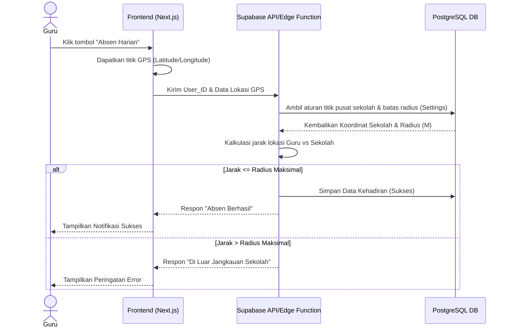
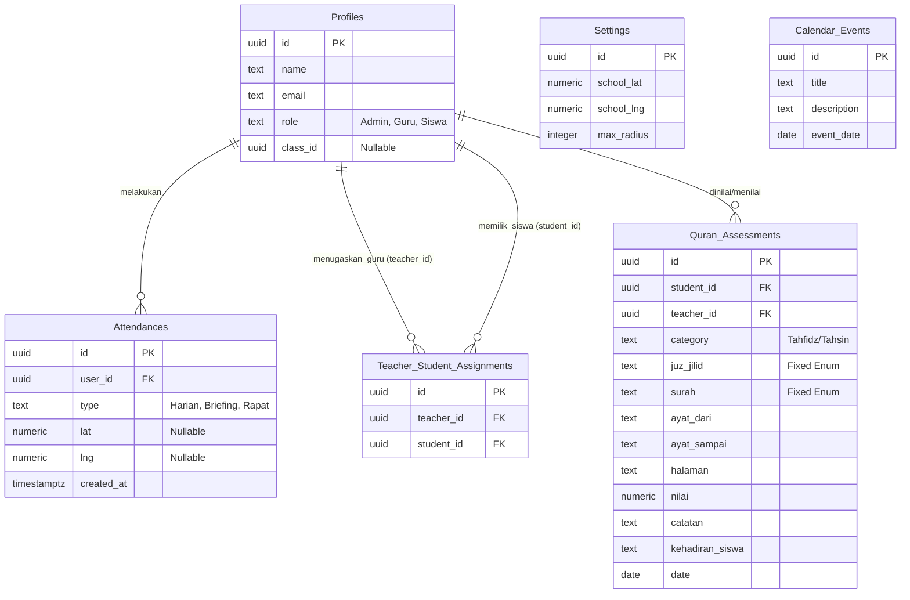

# PRD — Project Requirements Document

## 1. Overview
Aplikasi ini adalah platform manajemen absensi dan penilaian akademik berbasis website (Desktop Web) yang dirancang khusus untuk sekolah. Aplikasi ini menyelesaikan masalah pencatatan kehadiran guru yang masih manual dengan menyediakan sistem absensi berbasis lokasi (radius GPS) untuk absen harian, serta absensi cepat tanggap (1-klik) untuk kegiatan *briefing* dan rapat. Selain itu, aplikasi mendigitalisasi sistem Penilaian Al-Qur'an (Tahfidz dan Tahsin) agar lebih terstruktur, mudah diinput oleh guru yang ditugaskan, dan laporannya terpusat serta dapat diekspor oleh tata usaha atau Admin.

## 2. Requirements
- **Platform:** Aplikasi berbasis Desktop Web (namun antarmuka harus responsif agar fitur GPS browser di HP tetap dapat berjalan dengan baik).
- **Otentikasi:** Sistem login berbasis peran (Admin, Guru, dan Siswa) menggunakan Supabase Auth.
- **Sistem Lokasi:** Pendeteksian lokasi menggunakan fitur GPS Bawaan (Browser Geolocation API) untuk absensi batas radius.
- **Notifikasi:** Memberikan pemberitahuan di dalam aplikasi (*In-App Notification*) mengenai status absensi atau pembaruan sistem.
- **Pelaporan:** Seluruh laporan absensi dan nilai dapat dilihat secara rekapitulasi dan diekspor ke dalam format file Excel (.xlsx).

## 3. Core Features
- **Sistem Akun Berbasis Peran:** 
  - **Admin:** Memiliki akses penuh mengatur kalender, mengatur batas radius absensi, menugaskan daftar siswa ke guru, dan melihat/mengekspor (Excel) semua rekapitulasi.
  - **Guru:** Memiliki *dashboard* pribadi untuk melakukan absensi, melihat riwayat absensi sendiri, dan memasukkan nilai Al-Qur'an untuk siswa yang ditugaskan.
  - **Siswa:** Dapat login untuk melihat kalender sekolah dan melihat nilai Al-Qur'an pribadi mereka.
- **Modul Absensi Guru:**
  - **Absen Harian (Radius):** Absen menggunakan deteksi lokasi. Hanya terekam jika lokasi guru berada di dalam radius maksimal dari titik sekolah yang diatur Admin.
  - **Absen Briefing & Rapat:** Absen cukup dengan menekan tombol (1-klik) pada *dashboard* saat kegiatan berlangsung. Riwayat akan tersimpan otomatis.
- **Kalender Kegiatan Sekolah:** Kalender interaktif yang hanya dapat dibuat/diedit oleh Admin, namun dapat dilihat oleh semua peran (Guru dan Siswa) di *dashboard* mereka.
- **Modul Penilaian Al-Qur'an:**
  - **Penugasan:** Guru hanya dapat menilai siswa yang telah di-*assign* oleh Admin (data difilter per kelas).
  - **Input Tahfidz:** Form mencakup Tanggal, Nama, Kelas, Juz (pilihan *fixed*), Surat (pilihan *fixed*), Ayat Dari, Ayat Sampai, dan Nilai.
  - **Input Tahsin:** Form mencakup Tanggal, Nama, Kelas, Jilid/Surah (pilihan *fixed*), Halaman, dan Nilai.
  - **Atribut Tambahan Penilaian:** Terdapat input untuk Absensi/Keterangan siswa saat mengaji dan Catatan evaluasi dari guru.
  - **Rekapitulasi Penilaian:** Laporan yang dapat difilter berdasarkan kelas maupun keseluruhan siswa.

## 4. User Flow
**Alur Guru (Aktivitas Harian):**
1. Guru login menggunakan kredensial mereka (via Supabase Auth).
2. Dialihkan ke *Dashboard* Guru (menampilkan notifikasi *in-app* dan status absen hari ini).
3. Guru melakukan Absen Harian (sistem meminta izin lokasi GPS, jika dalam radius, status absen sukses).
4. Saat ada rapat/briefing, guru klik tombol "Absen Briefing" atau "Absen Rapat" di *dashboard*.
5. Masuk ke menu "Penilaian Al-Qur'an", memilih kelas dan siswa yang ditugaskan.
6. Mengisi form nilai (Tahfidz atau Tahsin), catatan, lalu menyimpan data.

**Alur Admin (Manajemen Sekolah):**
1. Admin login ke *Dashboard* Utama.
2. Mengubah pengaturan radius absensi sekolah jika diperlukan.
3. Menambahkan jadwal acara di Kalender Sekolah.
4. Memasangkan (*assign*) data siswa ke guru pengampu Al-Qur'an.
5. Membuka menu Laporan (Absen Guru atau Nilai Siswa), melakukan filter per kelas/bulan, lalu klik "Export Excel".

## 5. Architecture
Aplikasi ini menggunakan arsitektur web modern *Client-Server* dengan integrasi *Backend-as-a-Service* (Supabase). *Frontend* dibangun menggunakan Next.js yang berkomunikasi langsung dengan Supabase Client untuk otentikasi dan pengambilan data. Logika bisnis sensitif (seperti validasi radius GPS) akan ditangani melalui Supabase Edge Functions atau API Routes Next.js yang terhubung ke database PostgreSQL untuk keamanan maksimal.

## 6. Database Schema
Berikut adalah gambaran tabel utama pada sistem pendukung beroperasinya fitur menggunakan PostgreSQL (Supabase). Skema ini mengimplementasikan *Row Level Security* (RLS) untuk keamanan data.

- **Profiles (Users):** Menyimpan data tambahan pengguna yang terhubung dengan `auth.users`. Kolom: `id` (uuid, PK, ref auth.users), `name`, `email`, `role`, `class_id` (jika siswa).
- **Settings:** Menyimpan konfigurasi umum oleh admin. Kolom: `id`, `school_lat`, `school_lng`, `max_radius`.
- **Attendances:** Riwayat absensi guru. Kolom: `id`, `user_id`, `type` (harian, briefing, rapat), `status`, `lat`, `lng`, `created_at`.
- **Teacher_Student_Assignments:** Mengatur hak akses guru untuk menilai siswa tertentu. Kolom: `id`, `teacher_id`, `student_id`.
- **Quran_Assessments:** Menyimpan data nilai ngaji siswa. Kolom: `id`, `student_id`, `teacher_id`, `category` (tahfidz/tahsin), `juz_jilid`, `surah`, `ayat_dari`, `ayat_sampai`, `halaman`, `nilai`, `catatan`, `kehadiran_siswa`, `date`.
- **Calendar_Events:** Menyimpan agenda sekolah. Kolom: `id`, `title`, `description`, `event_date`.

## 7. Tech Stack
Aplikasi akan dibangun secara efisien menggunakan tumpukan teknologi modern berkinerja tinggi yang terintegrasi dengan ekosistem Supabase:

- **Frontend:** Next.js (Mendukung Server Side Rendering dan integrasi API yang fleksibel).
- **Styling & UI Components:** Tailwind CSS dan shadcn/ui (Untuk pembuatan antarmuka pengguna yang cepat, *clean*, dan dapat disesuaikan).
- **Backend & Database:** Supabase (Menyediakan PostgreSQL Database, Otentikasi, dan Edge Functions).
- **Supabase Client:** `@supabase/supabase-js` (Untuk komunikasi antara Frontend dan layanan Supabase).
- **Fitur Tambahan:**
  - *Excel Exporting:* `xlsx` atau library serupa untuk menghasilkan laporan Excel.
  - *Geolocation:* HTML5 Native Geolocation API di dalam browser.
  - *Security:* Supabase Row Level Security (RLS) untuk proteksi data tingkat baris.

## Ringkasan Chat Berjalan
Belum ada ringkasan sebelumnya

## Riwayat Chat
User: backend server menggunakan supabase

## Permintaan Revisi dari User
Ganti arsitektur dan tech stack untuk menggunakan Supabase sebagai penyedia backend dan database. Perbarui bagian Database Schema untuk mencerminkan penggunaan PostgreSQL (via Supabase) dan sesuaikan Tech Stack dengan mengganti SQLite dan Drizzle ORM menjadi Supabase (PostgreSQL & Auth). Tambahkan integasi Supabase Client di bagian Arsitektur.

## Instruksi
- Revisi PRD berdasarkan permintaan user
- Kembalikan PRD yang LENGKAP (bukan hanya bagian yang diubah)
- Pertahankan format dan struktur yang sama
- Tulis dalam Bahasa Indonesia
- Mulai langsung dengan "# PRD — Project Requirements Document" tanpa pembukaan atau penjelasan
  - JANGAN tambahkan komentar atau penjelasan di luar PRD